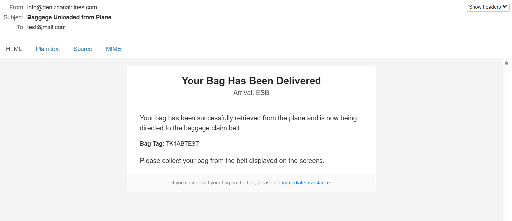

# IATA R753 Baggage Tracking System

**IATA Resolution 753** is an industry standard that requires airlines to track baggage at key points in the journey.
According to this regulation, each baggage item must be recorded and tracked during critical stages such as **check-in**, **aircraft loading**, **unloading**, and **delivery**.

This project is a **modular, event-driven baggage tracking system** designed to meet the core requirements of **IATA R753**.

* **Management Service** → Manages baggage movements and publishes events via Kafka and WebSocket.
* **Notification Service** → Listens to Kafka messages and send e-mail notifications to clients.
* **Tracking UI** → Visualizes baggage status in real time with map location support.

**Purpose:** Demonstrate a scalable, real-time, and traceable baggage tracking solution implementing the IATA R753 standard in a modern software architecture.

**Tech Stack:** Java, Spring Boot, JPA, REST, Websocket, Postgres, Kafka, React, Typescript, STOMP, Antd UI Library 

-----

## How to run

- Start docker daemon in your local.
- Follow commands below:

```
    cd docker
    docker-compose up
```

- For stopping services:

```
CTRL + C (stop run of docker-compose)
```

- For removing containers:

```
docker-compose down
```

- For removing everything (including volumes):

```
docker-compose down -v
```

### Service addresses:

```
| Tracking UI | http://localhost:3000 |
| Management Service | http://localhost:8090 |
| Notification Service | http://localhost:8091 |
| DLQ Notification Service | http://localhost:8092 |
| Kafka UI | http://localhost:8080 |
| MailHog (for seeing mails) | http://localhost:8085 |
```

-----

## Kafka Events:

-----

- Kafka events were generated by `management-service` starting from baggage ```CHECKED_IN``` status.
- Swagger-UI for `management-service` available at `http://localhost:8090/swagger-ui/index.html`
- Outbox Events are saved at `management-service` for auditability.
- Notification service has mechanism for Retry. After 3 failed retries, it will send message to DLQ topic.
- DLQ Notification Service are separated from Notification Service to consume and handle failed messages from DLQ topic.

- ### Checked-in Event:
```
{
	"tag": "TK1ABTEST",
	"flightNumber": "TKTEST",
	"timestamp": [
		2025,
		8,
		15,
		11,
		36,
		0,
		554895544
	],
	"origin": "IST",
	"destination": "ESB",
	"passengerName": "test",
	"eventType": "CHECKED_IN",
	"handlingCarrier": "TK"
}
```
- Mail notification for this event:


-----

- ### Loaded Event:
```
{
	"tag": "TK1ABTEST",
	"flightNumber": "TKTEST",
	"timestamp": [
		2025,
		8,
		15,
		11,
		36,
		0,
		554896000
	],
	"origin": "IST",
	"destination": "ESB",
	"passengerName": "test",
	"eventType": "LOADED",
	"handlingCarrier": "TK"
}
```
- Mail notification for this event:


-----

- ### Unloaded Event:
```
{
	"tag": "TK1ABTEST",
	"flightNumber": "TKTEST",
	"timestamp": [
		2025,
		8,
		15,
		11,
		36,
		0,
		554896000
	],
	"origin": "IST",
	"destination": "ESB",
	"passengerName": "test",
	"eventType": "UNLOADED",
	"handlingCarrier": "TK"
}
```
- Mail notification for this event:



-----

- ### Delivered Event:
```
{
	"tag": "TK1ABTEST",
	"flightNumber": "TKTEST",
	"timestamp": [
		2025,
		8,
		15,
		11,
		36,
		0,
		554896000
	],
	"origin": "IST",
	"destination": "ESB",
	"passengerName": "test",
	"eventType": "DELIVERED",
	"handlingCarrier": "TK"
}
```
- Mail notification for this event:


-----

- ### Claimed Event:
```
{
	"tag": "TK1ABTEST",
	"flightNumber": "TKTEST",
	"timestamp": [
		2025,
		8,
		15,
		11,
		36,
		0,
		554896000
	],
	"origin": "IST",
	"destination": "ESB",
	"passengerName": "test",
	"eventType": "CLAIMED",
	"handlingCarrier": "TK"
}
```

- There is no mail notification for this event.

## Live Luggage Tracking UI:

-----

- Real time data gathering for luggage updates via websocket
- React, Typescript, REST, STOMP was used.
- UI serve at: `localhost:3000`


- Updated Luggages will be highlighted for 2 seconds.


- It is also possible to click the airport name on location column and see a map preview of selected location.
- Location will be updated with Destination airport when status is transitioning from `LOADED` to `UNLOADED`


