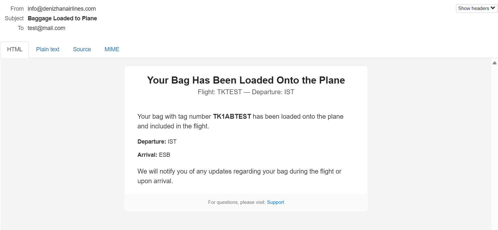

## Kafka Events:

-----

- Kafka events were generated by `management-service`
- `management-service` serves at `localhost:8090`
- Swagger-UI for `management-service` available at `http://localhost:8090/swagger-ui/index.html`

- ### Checked-in Event:
```
{
	"tag": "TK1ABTEST",
	"flightNumber": "TKTEST",
	"timestamp": [
		2025,
		8,
		15,
		11,
		36,
		0,
		554895544
	],
	"origin": "IST",
	"destination": "ESB",
	"passengerName": "test",
	"eventType": "CHECKED_IN",
	"handlingCarrier": "TK"
}
```
- Mail notification for this event:


-----

- ### Loaded Event:
```
{
	"tag": "TK1ABTEST",
	"flightNumber": "TKTEST",
	"timestamp": [
		2025,
		8,
		15,
		11,
		36,
		0,
		554896000
	],
	"origin": "IST",
	"destination": "ESB",
	"passengerName": "test",
	"eventType": "LOADED",
	"handlingCarrier": "TK"
}
```
- Mail notification for this event:



-----

- ### Unloaded Event:
```
{
	"tag": "TK1ABTEST",
	"flightNumber": "TKTEST",
	"timestamp": [
		2025,
		8,
		15,
		11,
		36,
		0,
		554896000
	],
	"origin": "IST",
	"destination": "ESB",
	"passengerName": "test",
	"eventType": "UNLOADED",
	"handlingCarrier": "TK"
}
```
- Mail notification for this event:


-----

- ### Delivered Event:
```
{
	"tag": "TK1ABTEST",
	"flightNumber": "TKTEST",
	"timestamp": [
		2025,
		8,
		15,
		11,
		36,
		0,
		554896000
	],
	"origin": "IST",
	"destination": "ESB",
	"passengerName": "test",
	"eventType": "DELIVERED",
	"handlingCarrier": "TK"
}
```
- Mail notification for this event:


-----

- ### Claimed Event:
```
{
	"tag": "TK1ABTEST",
	"flightNumber": "TKTEST",
	"timestamp": [
		2025,
		8,
		15,
		11,
		36,
		0,
		554896000
	],
	"origin": "IST",
	"destination": "ESB",
	"passengerName": "test",
	"eventType": "CLAIMED",
	"handlingCarrier": "TK"
}
```

- There is no mail notification for this event.

## Live Luggage Tracking UI:

-----

- Real time data gathering for luggage updates via websocket
- React, Typescript, REST, STOMP was used.
- UI serve at: `localhost:3000`


- Updated Luggages will be highlighted for 2 seconds.


- It is also possible to click the airport name on location column and see a map preview of selected location.


